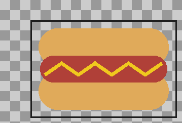
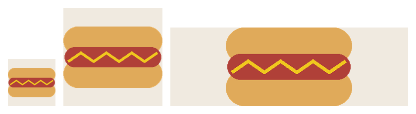
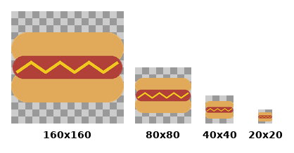

# ComfyUI Ideogram Image and Text Tools


Generate a logo. Build a sticker sheet. Export every size you need.
All without leaving ComfyUI.

> ⚠️ **Before you wire anything up:** every node here uses the inverse
> of ComfyUI's default mask convention. Read
> [Core Concept: the Alpha Convention](#core-concept-the-alpha-convention)
> first, or you'll get silently wrong output, not an error.

## Why This Exists

This repository turns generated images — from Ideogram or anywhere
else — into production-ready creative assets: sticker sheets, logo
packages, wordmarks, multi-size exports, all as composable ComfyUI
nodes.

The Ideogram ecosystem already has prompt builders, JSON builders,
layout tools, character tools, background removal solutions, and
generic image editing tools. This repository does not duplicate any
of that — it focuses on the gap after generation: turning a finished
image into something you can actually ship.

Concretely: generated images get **prepared** (AlphaPrep,
WordmarkGenerator) and then **packaged** (StickerSheetBuilder,
LogoAssetBuilder, AssetPackExport).

## Quickstart

The minimum useful chain — five minutes to a real exported asset,
and the foundation every other workflow in this repo builds on:

```
LoadImage -> AlphaPrep: Mask Adapter -> AlphaPrep: Trim
  -> AlphaPrep: Mask Adapter -> JoinImageWithAlpha -> SaveImage
```

This loads any image, strips its transparent border, and saves it
back out with correct alpha.

For something to actually open and look at, **[workflows/](workflows/)**
has three polished, ready-to-load templates — each with a yellow
README note built into the graph explaining what it does and what to
change:

- **[Sticker Prep Pipeline](workflows/01_sticker_prep_pipeline.json)**
  — this quickstart chain, plus outline/shadow/resize.
- **[Sticker Sheet from Three Logos](workflows/02_sticker_sheet_from_three_logos.json)**
  — batch multiple assets into one packed sheet.
- **[Full Brand Kit from One Logo](workflows/03_full_brand_kit_from_one_logo.json)**
  — the most complete single-graph tour: `LogoAssetBuilder`,
  `AssetPackExport`, and `ThumbnailLegibilityCheck` together.

[examples/](examples/) also has a flat-format workflow per node
system, used by this repo's own test suite — see
[workflows/README.md](workflows/README.md) for how the two folders
differ.

## Status

All six node systems below are implemented, each with an example
workflow in [examples/](examples/) and verified end-to-end against a
live ComfyUI instance. See [CHANGELOG.md](CHANGELOG.md) for version
history and [docs/](docs/) for design notes and known limitations.

## Node Systems

1. **AlphaPrep** (implemented) — trim transparent borders, expand the
   canvas by explicit per-edge padding, pad, center, resize canvas,
   generate sticker outlines and drop shadows, preview against
   backgrounds, and adapt the mask convention at ComfyUI core
   boundaries. See [docs/nodes/alphaprep.md](docs/nodes/alphaprep.md).

   

   *Trim → Outline → Drop Shadow → Resize Canvas → Preview Background, chained.*

   

   *Canvas Expand adds asymmetric per-edge padding (here: 40px top, 60px left, 10px bottom/right) — the outline marks the original trimmed bounds.*

2. **StickerSheetBuilder** (implemented) — pack multiple transparent
   assets into print-ready sticker sheets with configurable layouts,
   margins, and sheet sizes. See
   [docs/nodes/stickersheetbuilder.md](docs/nodes/stickersheetbuilder.md).

   

   *Five hotdog variants packed with the `packed` (shelf) layout.*

3. **WordmarkGenerator** (implemented) — typography-first branding
   asset generation (band logos, product names, podcast branding,
   etc.). This renders text directly with Pillow and a font file —
   no Ideogram or other image-generation call involved. **On Linux**,
   pass an explicit `font_path`: the bundled fallback font names
   default to Windows/macOS fonts and silently degrade to a
   low-fidelity bitmap font otherwise (see Known Limitations). See
   [docs/nodes/wordmarkgenerator.md](docs/nodes/wordmarkgenerator.md).

   

   *Rendered directly from text with the `wide` style preset — no image generation involved.*

4. **LogoAssetBuilder** (implemented) — full logo asset packages:
   variants, transparent exports, square/banner versions, monochrome
   versions. See
   [docs/nodes/logoassetbuilder.md](docs/nodes/logoassetbuilder.md).

   | Transparent | Square | Banner | Monochrome |
   | --- | --- | --- | --- |
   |  |  |  |  |

   *One logo asset in, four production-ready package outputs out.*

5. **AssetPackExport** (implemented) — export one asset at multiple
   named target sizes (e.g. `icon:128x128, square:512x512,
   banner:1500x500`) in a single pass, one execution per requested
   size via ComfyUI's list-output mechanism. See
   [docs/nodes/assetpackexport.md](docs/nodes/assetpackexport.md).

   

   *One `sizes` spec (`icon:96x96, square:200x200, banner:480x160`), three exports, one execution.*

6. **ThumbnailLegibilityCheck** (implemented) — render an asset at
   multiple small sizes side by side, each at real pixel dimensions,
   to check whether a logo/sticker survives at icon/favicon scale
   before shipping it. See
   [docs/nodes/thumbnaillegibilitycheck.md](docs/nodes/thumbnaillegibilitycheck.md).

   

   *Each thumbnail is rendered at its real pixel size, not scaled up — this is what it actually looks like that small.*

## Design Principles

- Follow standard ComfyUI node conventions; no custom image formats.
- Every node solves a real production problem — no novelty or gimmick
  features.
- Small, focused, composable nodes over giant all-in-one nodes.
- Asset workflows first, API wrappers second.
- Works with any image source where possible, not just Ideogram.

## Non-Goals

This repository will not implement prompt generators, prompt mutators,
shot planners, JSON builders, layout/character planners, dataset tools,
or LoRA/training tools. Those belong in other repositories.

Background removal is a deliberate non-priority too — it's not the
primary value of this repository, and may be added later only as a
supporting utility, not a lead feature.

## Core Concept: the Alpha Convention

Every node in this repository treats `IMAGE` + `MASK` as a single
transparent asset, where `MASK` is the asset's **alpha channel**:
`1.0` = opaque content, `0.0` = fully transparent. All six node
systems — AlphaPrep, StickerSheetBuilder, WordmarkGenerator,
LogoAssetBuilder, AssetPackExport, and ThumbnailLegibilityCheck —
depend on this shared contract; it's the one thing
to understand before wiring nodes together.

**This is the opposite of ComfyUI's own inpainting-mask convention**
(where `1.0` means "masked out"). Concretely: `LoadImage`'s `MASK`
output and `JoinImageWithAlpha`'s `alpha` input both expect the
inpainting-style convention, not this package's. Use **AlphaPrep: Mask
Adapter** at both boundaries — `LoadImage -> AlphaPrep: Mask Adapter ->`
any node here, and any node here `-> AlphaPrep: Mask Adapter ->
JoinImageWithAlpha -> SaveImage`. See
[docs/README.md](docs/README.md#mask-convention--read-this-before-wiring-to-core-comfyui-nodes)
for the full explanation, and [examples/](examples/) for working
reference wiring.


## Known Limitations

- **Mask convention mismatch with core ComfyUI nodes** (see above) —
  forgetting **AlphaPrep: Mask Adapter** at either boundary produces
  silently wrong output, not an error.
- **`WordmarkGenerator` font fallback on Linux**: if no `font_path` is
  supplied and none of the fallback system font names
  (`DejaVuSans-Bold.ttf`, `DejaVuSans.ttf`, `arial.ttf`) resolve on
  the host, it silently falls back to Pillow's low-fidelity built-in
  bitmap font. `arial.ttf` in particular is a Windows/macOS font name
  and will not resolve on most Linux ComfyUI installs. Supply an
  explicit `font_path` for predictable typography on Linux.

## Installation

Clone this repository into your ComfyUI `custom_nodes/` directory and
restart ComfyUI:

```
cd ComfyUI/custom_nodes
git clone https://github.com/SurrealByDesign/ComfyUI_Ideogram_Image_and_Text_Tools.git
```

No extra dependencies to install — this package only needs `torch`,
`numpy`, and `Pillow`, all of which ComfyUI already provides.

Most recently tested end-to-end against **ComfyUI 0.24.0**. The nodes
are plain Python with no version-specific API usage, so other recent
ComfyUI versions are likely fine, but 0.24.0 is the only version this
has actually been run against — this line will be updated as newer
versions get verified.

## Testing

```
pytest
```

## Contributing

See [CONTRIBUTING.md](CONTRIBUTING.md) for coding and testing standards.

## License

See [LICENSE](LICENSE).
