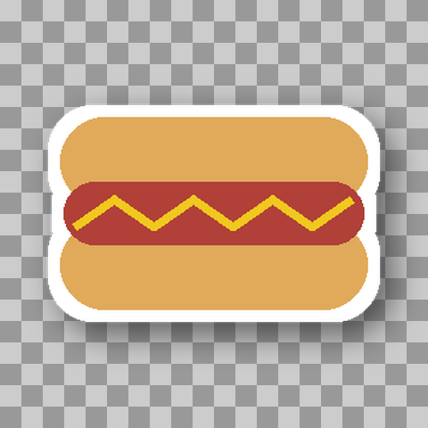
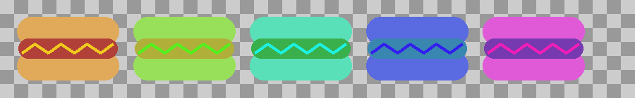
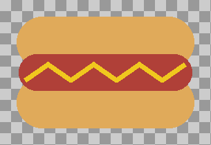

# ComfyUI Ideogram Image and Text Tools


Take Ideogram outputs and turn them into usable assets.

## Why This Exists

The Ideogram ecosystem already has prompt builders, JSON builders, layout
tools, character tools, background removal solutions, and generic image
editing tools. This repository does not duplicate any of that.

Instead, it focuses on a gap that is currently underserved: turning
generated images into production-ready creative assets.

```
Generate assets -> Prepare assets -> Package assets
```

## Status

v1.0 is tagged. All four v1 node systems are implemented: AlphaPrep,
StickerSheetBuilder, WordmarkGenerator, and LogoAssetBuilder, each with
example workflows in [examples/](examples/) and verified end-to-end
against a live ComfyUI instance. See [CHANGELOG.md](CHANGELOG.md) for
progress and [docs/](docs/) for design notes and known limitations.

## Node Systems (in build order)

1. **AlphaPrep** (implemented) — trim transparent borders, pad, center,
   resize canvas, generate sticker outlines and drop shadows, preview
   against backgrounds, and adapt the mask convention at ComfyUI core
   boundaries. See [docs/nodes/alphaprep.md](docs/nodes/alphaprep.md).

   

   *Trim → Outline → Drop Shadow → Resize Canvas → Preview Background, chained.*

2. **StickerSheetBuilder** (implemented) — pack multiple transparent
   assets into print-ready sticker sheets with configurable layouts,
   margins, and sheet sizes. See
   [docs/nodes/stickersheetbuilder.md](docs/nodes/stickersheetbuilder.md).

   

   *Five hotdog variants packed with the `packed` (shelf) layout.*

3. **WordmarkGenerator** (implemented) — typography-first branding
   asset generation (band logos, product names, podcast branding,
   etc.). See
   [docs/nodes/wordmarkgenerator.md](docs/nodes/wordmarkgenerator.md).

   

   *Rendered directly from text with the `wide` style preset — no image generation involved.*

4. **LogoAssetBuilder** (implemented) — full logo asset packages:
   variants, transparent exports, square/banner versions, monochrome
   versions. See
   [docs/nodes/logoassetbuilder.md](docs/nodes/logoassetbuilder.md).

   | Transparent | Square | Banner | Monochrome |
   | --- | --- | --- | --- |
   |  |  |  |  |

   *One logo asset in, four production-ready package outputs out.*

Background removal and other supporting utilities may be added later,
but are not the primary value of this repository.

## Design Principles

- Follow standard ComfyUI node conventions; no custom image formats.
- Every node solves a real production problem — no novelty or gimmick
  features.
- Small, focused, composable nodes over giant all-in-one nodes.
- Asset workflows first, API wrappers second.
- Works with any image source where possible, not just Ideogram.

## Non-Goals

This repository will not implement prompt generators, prompt mutators,
shot planners, JSON builders, layout/character planners, dataset tools,
or LoRA/training tools. Those belong in other repositories.

## Core Concept: the Alpha Convention

Every node in this repository treats `IMAGE` + `MASK` as a single
transparent asset, where `MASK` is the asset's **alpha channel**:
`1.0` = opaque content, `0.0` = fully transparent. All composability
between AlphaPrep, StickerSheetBuilder, WordmarkGenerator, and
LogoAssetBuilder depends on this shared contract — it's the one thing
to understand before wiring nodes together.

**This is the opposite of ComfyUI's own inpainting-mask convention**
(where `1.0` means "masked out"). Concretely: `LoadImage`'s `MASK`
output and `JoinImageWithAlpha`'s `alpha` input both expect the
inpainting-style convention, not this package's. Use **AlphaPrep: Mask
Adapter** at both boundaries — `LoadImage -> AlphaPrep: Mask Adapter ->`
any node here, and any node here `-> AlphaPrep: Mask Adapter ->
JoinImageWithAlpha -> SaveImage`. See
[docs/README.md](docs/README.md#mask-convention--read-this-before-wiring-to-core-comfyui-nodes)
for the full explanation, and [examples/](examples/) for working
reference wiring.


## Known Limitations

- **Mask convention mismatch with core ComfyUI nodes** (see above) —
  forgetting **AlphaPrep: Mask Adapter** at either boundary produces
  silently wrong output, not an error.
- **`WordmarkGenerator` font fallback on Linux**: if no `font_path` is
  supplied and none of the fallback system font names
  (`DejaVuSans-Bold.ttf`, `DejaVuSans.ttf`, `arial.ttf`) resolve on
  the host, it silently falls back to Pillow's low-fidelity built-in
  bitmap font. `arial.ttf` in particular is a Windows/macOS font name
  and will not resolve on most Linux ComfyUI installs. Supply an
  explicit `font_path` for predictable typography on Linux.

## Installation

Clone this repository into your ComfyUI `custom_nodes/` directory and
restart ComfyUI:

```
cd ComfyUI/custom_nodes
git clone https://github.com/SurrealByDesign/ComfyUI_Ideogram_Image_and_Text_Tools.git
```

No extra dependencies to install — this package only needs `torch`,
`numpy`, and `Pillow`, all of which ComfyUI already provides.

Live-verified against **ComfyUI 0.24.0**. The nodes are plain Python
with no version-specific API usage, so other recent ComfyUI versions
should work too, but 0.24.0 is the only version this has actually been
run against end-to-end.

## Testing

```
pytest
```

## Contributing

See [CONTRIBUTING.md](CONTRIBUTING.md) for coding and testing standards.

## License

See [LICENSE](LICENSE).
